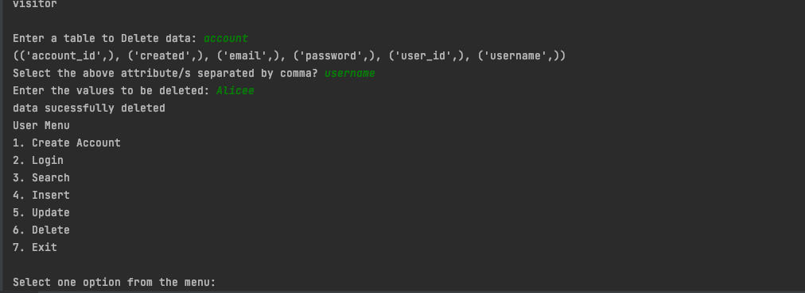

Created by : Bikram Tamang
CSC 676 Final project

Python API for connecting MySQL database

How to run :

1) To run the program:  

clone the repository in your machine. 
Edit the sqlconfig.conf file with your mysql log in information for the local host. 
Make sure you have python 3 or later installed on your machine
Navigate the directory using the terminal
do the command "python3 user_interface.py"
        or
Use a python IDE to run the program like pycharm

2) Version of the progamming language: Python3.8

Option 1: Create an account:

option 2: log in 

option 3: search 

option 4: insert 

option 5: update 

option 6: delete

option 7: Exit

Challanges Faced and overcoming them:
The greates challange for this project was the python language was not familiar to me 
took me some time to research and work around the project.
Professor video for some of the implementation were very helpful. 
which was the key factor to overcome the obstacle i faced during the project. 

